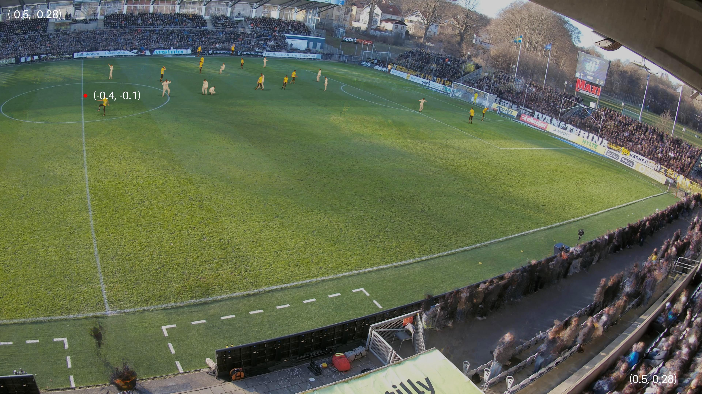
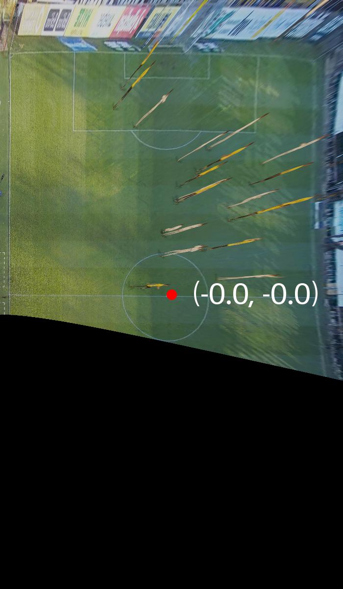

<div align="center">

# Spiideo SoccerNet SynLoc
## Single Frame World Coordinate Athlete Detection and Localization with Synthetic Data

[[Paper](https://arxiv.org/)] [[Baseline](https://github.com/Spiideo/mmpose/tree/spiideo_scenes)] [[Devkit](https://github.com/Spiideo/sskit)][[Data Download](https://research.spiideo.com/)]

</div>

>**[Spiideo SoccerNet SynLoc - Single Frame World Coordinate Athlete Detection and Localization with Synthetic Data](https://arxiv.org/)**
>
> ...
>
>[*arxiv*](https://arxiv.org/)
>


Welcome to the Development Kit for the Spiideo SoccerNet SynLoc task and Challange. This kit is meant as a help to get started working with the data and the proposed task.

## Installation
The easiest way to install sskit is to use pip:
```bash
  pip install sskit
```

It is also possible to build manually:
```bash
  git clone https://github.com/Spiideo/sskit.git
  cd sskit
  python setup.py install
```

## Data Download
The Spiideo SoccerNet SynLoc data can be downloaded from [research.spiideo.com](https://research.spiideo.com/) after registering. Unpack the .zip files in `data/SoccerNet/SpiideoSynLoc`. To automate the download, the [`SoccerNet`](https://pypi.org/project/SoccerNet/) pypi package can be used:

```python
from SoccerNet.Downloader import SoccerNetDownloader
mySoccerNetDownloader=SoccerNetDownloader(LocalDirectory="data/SoccerNet")
mySoccerNetDownloader.downloadDataTask(task="SpiideoSynLoc", split=["train","valid","test","challenge"])
```

This will download full resolution 4K images. To instead download the smaller fullhd versions, use:

```python
mySoccerNetDownloader.downloadDataTask(task="SpiideoSynLoc", split=["train","valid","test","challenge"], version="fullhd")
```

## mAP-LocSim Evaluation

Tools for evaluating a solution using the proposed mAP-LocSim metrics can be found in `sskit.coco`. It's an adaption of
[`xtcocotools`](https://pypi.org/project/xtcocotools/), and is used in a similar way. Annotations and results are stored
in coco format with the ground location of the objects placed in the position_on_pitch key as a 3D pitch coordinate in meters. A minimal results file, res.json, with 3 detections (two in the first image and one in the second) could look like this:
```json
  [
    {
        "area" : 0,
        "category_id" : 1,
        "id" : 1,
        "image_id" : 1,
        "position_on_pitch" : [
          1.2,
          2,
          0
        ],
        "score" : 0.91
    },
    {
        "area" : 0,
        "category_id" : 1,
        "id" : 2,
        "image_id" : 1,
        "position_on_pitch" : [
          5,
          10,
          0
        ],
        "score" : 0.85
    },
    {
        "area" : 0,
        "category_id" : 1,
        "id" : 3,
        "image_id" : 2,
        "position_on_pitch" : [
          10.2,
          20,
          0
        ],
        "score" : 0.83
    }
  ]
```
It can be evaluated against a minimal ground truth file, gt.json, that could look like this:
```json
  {
    "annotations" : [
        {
          "area" : 0,
          "category_id" : 1,
          "id" : 1,
          "image_id" : 1,
          "position_on_pitch" : [
              1,
              2,
              0
          ]
        },
        {
          "area" : 0,
          "category_id" : 1,
          "id" : 2,
          "image_id" : 2,
          "position_on_pitch" : [
              10,
              20,
              0
          ]
        }
    ],
    "categories" : [
        {
          "id" : 1,
          "name" : "person"
        }
    ],
    "images" : [
        {
          "id" : 1
        },
        {
          "id" : 2
        }
    ]
  }
```
using the code:
  ```python
  from xtcocotools.coco import COCO
  from sskit.coco import LocSimCOCOeval

  coco = COCO('gt.json')
  coco_det = coco.loadRes("res.json")
  coco_eval = LocSimCOCOeval(coco, coco_det, 'bbox')
  coco_eval.params.useSegm = None

  coco_eval.evaluate()
  coco_eval.accumulate()
  coco_eval.summarize()

  map_locsim = coco_eval.stats[0]
  frame_accuracy = coco_eval.stats[16]

  score_threshold = coco_eval.stats[15]
```

This will select a score threshold that maximizes the F1-score, which will make that score biased for the validation set.
To get unbiased scores on the test-set, the score threshold found for the validation set should be used there:
```python
  coco = COCO('data/SoccerNet/SpiideoSynLoc/annotations/test.json')
  coco_det = coco.loadRes("res.json")
  coco_eval = LocSimCOCOeval(coco, coco_det, 'bbox')
  coco_eval.params.useSegm = None
  coco_eval.params.score_threshold = score_threshold

  coco_eval.evaluate()
  coco_eval.accumulate()
  coco_eval.summarize()
```

For convenience it is also possible to place the detected location in image space as one of the keypoints. That
image location will then be projected onto the ground plane using the camera model. To do that set the
`position_from_keypoint_index` parameter to the index of the keypoint containing the image location. To evaluate results on the validation set stored in `validation_results.json`, use:
```python
  from xtcocotools.coco import COCO
  from sskit.coco import LocSimCOCOeval

  coco = COCO('data/SoccerNet/SpiideoSynLoc/annotations/val.json')
  coco_det = coco.loadRes("validation_results.json")
  coco_eval = LocSimCOCOeval(coco, coco_det, 'bbox', [0.089, 0.089], True)
  coco_eval.params.useSegm = None
  coco_eval.params.position_from_keypoint_index = 1

  coco_eval.evaluate()
  coco_eval.accumulate()
  coco_eval.summarize()

  score_threshold = coco_eval.stats[15]
  score_threshold = coco_eval.stats[15]
```

## Camera model

The camera model used in the dataset is a standard projective pihole camera model with radial distortion.
There are several different coordinate systems used (se pictures below), and functions to convert points
between them can be found in `sskit`. The World coordinates are either 3D or 2D ground coordinates with
the last coordinate assumed to be 0. The graph below shows the different coordinate systems and how they
relate to eachother:
```mermaid
  graph LR;
  Camera -- normalize() --> Normalized
  Normalized -- unnormalize() --> Camera
  Normalized -- undistort() --> Undistorted
  Undistorted -- distort() --> Normalized
  Undistorted -- undistorted_to_ground() --> World
  World -- world_to_undistorted() --> Undistorted
  World -- world_to_image() --> Normalized
  Normalized -- image_to_ground() --> World
```

To for eaxample project the center of the pitch, world coordinate (0,0,0), into the pytorch image, `img`, using a
camera matrix, `camera_matrix` and distortion parameters, `dist_poly`, from the dataset, use:
```python
  from sskit import unnormalize, world_to_image

  unnormalize(world_to_image(camera_matrix, dist_poly, [0.0, 0.0, 0.0]), img.shape)
```

A more comprehensive example that was used to create the illustrations below can be found in [`coordinate_systems.py`](coordinate_systems.py).

### Camera Image


### Normalized Image


### Undistorted Image


### Ground Plane


### Citation

If you use this code for your research, please cite:


